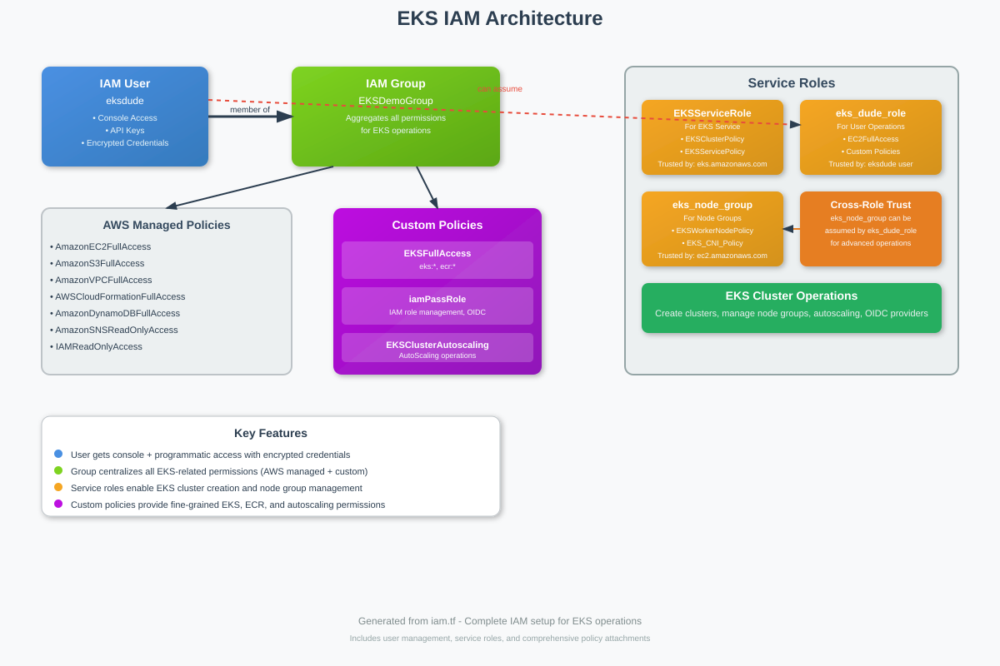

# EKS IAM Terraform Configuration

A comprehensive Terraform configuration that creates a complete IAM foundation for Amazon EKS (Elastic Kubernetes Service) operations. This setup provides secure, scalable permissions management for EKS cluster creation, management, and operations.

## 🏗️ Architecture Overview

This configuration establishes a robust IAM architecture centered around the principle of least privilege while providing comprehensive EKS operational capabilities. The setup includes user management, service roles, and fine-grained policies specifically designed for EKS workflows.



## 🎯 Key Features

- **🔐 Secure User Management**: Encrypted credentials with both console and programmatic access
- **👥 Centralized Permissions**: Group-based permission management following AWS best practices
- **🤖 Service Role Integration**: Properly configured roles for EKS services and node groups
- **🎛️ Custom Policy Framework**: Specialized policies for EKS, ECR, and autoscaling operations
- **🔗 Cross-Role Trust**: Advanced role assumption capabilities for complex scenarios
- **📊 Comprehensive Coverage**: Full spectrum of AWS services needed for EKS operations

## 📋 What Gets Created

### IAM Users
- **`eksdude`**: Primary user for EKS operations with encrypted password and API keys

### IAM Groups
- **`EKSDemoGroup`**: Central group containing all EKS-related permissions

### IAM Roles
- **`EKSServiceRole`**: For the EKS service to manage clusters
- **`eks_dude_role`**: For users to create and manage EKS resources
- **`eks_node_group`**: For EC2 instances in EKS node groups

### Custom Policies
- **`EKSFullAccess`**: Complete EKS and ECR permissions
- **`iamPassRole`**: IAM role management and OIDC provider operations
- **`EKSClusterAutoscaling`**: Auto Scaling Group management for cluster scaling

## 🔑 Permission Matrix

### AWS Managed Policies (via EKSDemoGroup)
| Policy | Purpose |
|--------|---------|
| `AmazonEC2FullAccess` | EC2 instance and networking management |
| `AmazonS3FullAccess` | S3 bucket operations for artifacts and state |
| `AmazonVPCFullAccess` | VPC, subnet, and security group management |
| `AWSCloudFormationFullAccess` | Infrastructure as Code operations |
| `AmazonDynamoDBFullAccess` | State locking and application data |
| `AmazonSNSReadOnlyAccess` | Notification service integration |
| `IAMReadOnlyAccess` | IAM resource inspection |

### Custom Policies

#### EKSFullAccess
```json
{
  "Version": "2012-10-17",
  "Statement": [
    {
      "Sid": "EKSFullAccess",
      "Effect": "Allow",
      "Action": [
        "eks:*",
        "ecr:*"
      ],
      "Resource": "*"
    }
  ]
}
```

#### Key Capabilities
- **EKS Operations**: Complete cluster lifecycle management
- **ECR Integration**: Container registry operations
- **Node Group Management**: Auto Scaling Group operations
- **OIDC Providers**: Service account integration
- **IAM Role Management**: Service role creation and attachment

## 🚀 Quick Start

### Prerequisites
- Terraform >= 0.12
- AWS CLI configured with appropriate permissions
- PGP key for credential encryption

### Variables Required
```hcl
variable "pgp_key" {
  description = "PGP public key for encrypting sensitive outputs"
  type        = string
}
```

### Deployment
```bash
# Initialize Terraform
terraform init

# Plan the deployment
terraform plan -var="pgp_key=YOUR_PGP_PUBLIC_KEY"

# Apply the configuration
terraform apply -var="pgp_key=YOUR_PGP_PUBLIC_KEY"
```

### Outputs
The configuration provides encrypted outputs for:
- **User Password**: Encrypted console password for `eksdude`
- **Access Key**: API access key for programmatic access
- **Secret Key**: Encrypted API secret key

## 🔒 Security Features

### Credential Protection
- All sensitive outputs are PGP encrypted
- Force destroy enabled for clean teardown
- Password complexity requirements enforced

### Role-Based Access Control
- Service-specific roles with minimal required permissions
- Cross-role trust relationships for advanced scenarios
- Proper trust policies for AWS services

### Policy Scoping
- Resource-specific ARNs where applicable
- Account-scoped permissions for security
- Principle of least privilege enforcement

## 🛠️ Usage Patterns

### EKS Cluster Creation
```bash
# Assume the EKS role for cluster operations
aws sts assume-role --role-arn arn:aws:iam::ACCOUNT:role/eks_dude_role --role-session-name eks-session

# Create EKS cluster using assumed role credentials
eksctl create cluster --name my-cluster --region us-east-1
```

### Node Group Management
The `eks_node_group` role is automatically used by EKS for:
- EC2 instance management
- Auto Scaling operations
- Container registry access
- Secrets management

### Autoscaling Configuration
The cluster autoscaler can use the `EKSClusterAutoscaling` policy for:
- Describing Auto Scaling Groups
- Modifying desired capacity
- Terminating instances
- Managing launch configurations

## 📊 Resource Relationships

```
eksdude (User)
├── Member of EKSDemoGroup
├── Can assume eks_dude_role
└── Has encrypted credentials

EKSDemoGroup (Group)
├── AWS Managed Policies (7)
├── Custom EKSFullAccess Policy
└── Custom iamPassRole Policy

Service Roles
├── EKSServiceRole (trusted by eks.amazonaws.com)
├── eks_dude_role (trusted by eksdude)
└── eks_node_group (trusted by ec2.amazonaws.com + eks_dude_role)
```

## 🔧 Customization

### Adding Additional Users
```hcl
resource "aws_iam_user" "additional_eks_user" {
  name = "eks-user-2"
  force_destroy = true
}

resource "aws_iam_user_group_membership" "additional_user" {
  user = aws_iam_user.additional_eks_user.name
  groups = [aws_iam_group.EKSDemoGroup.name]
}
```

### Extending Policies
Add additional managed policies to the group:
```hcl
resource "aws_iam_group_policy_attachment" "additional_policy" {
  group      = aws_iam_group.EKSDemoGroup.name
  policy_arn = "arn:aws:iam::aws:policy/AdditionalPolicy"
}
```

## ⚠️ Important Notes

- **Region Configuration**: Currently configured for `us-east-1`. Update OIDC provider ARNs if using different regions
- **Account Scoping**: IAM resources are scoped to the current AWS account
- **PGP Key Requirement**: A PGP public key is required for secure credential output
- **Cleanup**: The `force_destroy = true` setting enables clean resource removal

## 🤝 Contributing

1. Fork the repository
2. Create a feature branch
3. Make your changes
4. Test thoroughly in a development environment
5. Submit a pull request with detailed description

## 📝 License

This configuration is provided as-is for educational and operational purposes. Please review and adapt according to your organization's security requirements.

---

**Note**: Always review IAM policies and permissions in the context of your specific security requirements and compliance needs. This configuration provides broad permissions suitable for development and demonstration environments.